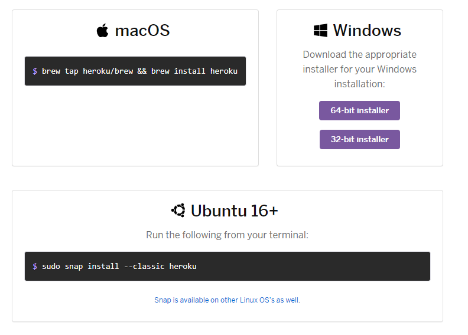
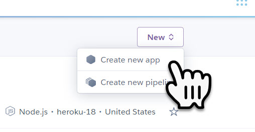
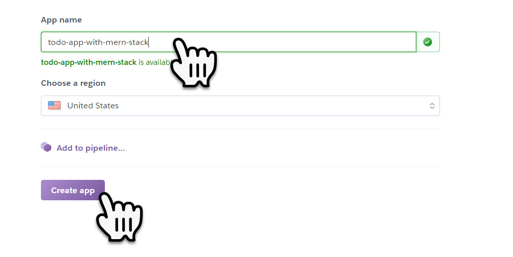
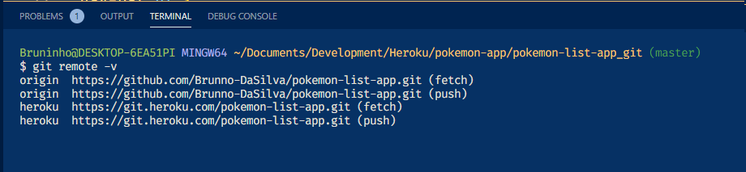

# Get started with Heroku

## Create an Account:

- [Sign up for Heroku](https://signup.heroku.com/)

  - You may need a CC at some point although you will not be charged

## Install Heroku CLI Tools:

- Once you have Heroku CLI, you can access terminal commands to heroku. [List of Heroku commands](https://devcenter.heroku.com/articles/heroku-cli-commands)

- In your terminal run `brew tap heroku/brew && brew install heroku` [Install Heroku CLI Tools](https://toolbelt.heroku.com/)
  - 

Install Heroku CLI Mac, Windows, and Ubuntu

         
    

### Confirm Installation:

- Verify by typing `heroku login` anywhere in your terminal

  - Then, press any key to continue

  - Follow prompts to sync up your heroku credentials

    - 

Add Heroku credentials

      

    - 

Heroku login confirmation

      

  - **DO NOT HEROKU CREATE yet**.

## Create an app on heroku

- Let's start by creating an app on heroku. If you don't yet have a name for your app it's ok, you can change it later (just make sure you update your git remotes too)

  - `heroku create YourAppUniqueName` from your project's root directory where you first initialized git.

    - This will check heroku to see if the app name exists, if so you'll get an error message and have to try again.

  - If you don't specify a name, heroku will generate a unique name for you. There names are pretty cool and somewhat thematic so feel free to do either.

  - You can also do this step off their website if you want but since you'll be working in terminal anyway, might as well just do it through terminal.

    

Create a New App on Heroku

    Access your account dashboard at [https://dashboard.heroku.com/apps](https://dashboard.heroku.com/apps)

    Click on the `New` dropdown button and select `Create new app`

    

    Add a unique name to your app and click on the `create app` button

    

    

### Important:

- Notice that if you successfully created a heroku app, you can see that the heroku remote was automatically added to your project's repo.

  - Confirm this by typing `git remote -v`, you should see `origin` as well as `heroku`.

  - 

Checking Heroku Origin

    
     

